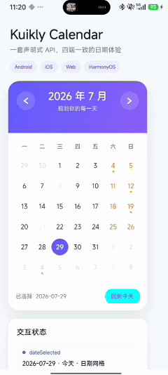

# KuiklyCalendarView

基于 [KuiklyUI](https://github.com/Tencent-TDS/KuiklyUI) 与 Kotlin Multiplatform
实现的跨端月份日历组件。组件提供月份切换、固定日期网格、日期选择、状态样式、
日期范围和类型化事件回调；核心 UI 与日期算法位于 `commonMain`，同一套 Kotlin
API 可用于 Android、iOS、Web（Kotlin/JS）和 OpenHarmony。


## 演示 Demo

<p align="center">
  <a href="docs/assets/kuikly-calendar-demo.gif">
    
  </a>
</p>

> 点击演示图可查看完整演示视频。

演示页面名为 `calendar_demo`，完整源码见
[`CalendarDemoPage.kt`](shared/src/commonMain/kotlin/com/guet/liang/kuiklycalendarview/CalendarDemoPage.kt)。
Demo 覆盖组件公开 API 的主要功能，并实时展示 `dateSelected` 与 `monthChanged`
回调结果。

## 题目验收对照

| 题目要求 | 本仓库实现 |
| --- | --- |
| 显示当前月份标题 | 根据当前 `CalendarMonth` 显示本地化年月标题 |
| 前后月份切换 | 左右导航按钮、`previousMonth()`、`nextMonth()` 与 `showMonth(...)` |
| 星期表头 | 支持周日或周一作为首列，并按 `CalendarLocale` 输出星期文案 |
| 日期正确排列 | `CalendarMath.buildMonthGrid` 固定生成连续的 `6 × 7`、共 42 个日期单元 |
| 点击选择日期 | 当前月和可选相邻月日期均支持点击，选中后更新组件状态 |
| 选中视觉高亮 | 选中圆形高亮、今天描边、周末色、禁用态、相邻月弱化和事件圆点 |
| 日期时间回调 | `dateSelected` 返回结构化日期、ISO 日期、星期、本地当日开始时间戳和触发来源 |
| 月份变化回调 | `monthChanged` 返回变化前后月份与导航来源 |
| 多平台支持 | 公共实现位于 `commonMain`，并提供 Android、iOS、JS 和 OpenHarmony target |
| API 文档与示例 | 本 README 提供完整配置、事件、命令式 API 和可运行 Demo |
| 加分项：现代样式 | 渐变头部、圆角卡片、阴影、状态配色、几何导航图标和主题 token |
| 加分项：友好交互 | 相邻月自动切换、今天快捷入口、范围边界禁用、轻量选中动画和按钮语义 |

## 能力矩阵

- 当前月份标题、前后月份导航、跨年切换和回到今天
- 固定 42 格日期模型，支持周日或周一起始
- 当前月、相邻月、今天、选中、禁用、周末和事件标记状态
- 日期闭区间限制与自定义 `dateEnabled` 业务规则
- `dateSelected`、`monthChanged` 类型化回调及触发来源
- `ViewRef<KuiklyCalendarView>` 命令式控制
- 简体中文、英文预设和自定义月份标题格式
- 可替换的颜色、圆角、间距和尺寸主题
- 不依赖 `java.time` 的纯 Kotlin Gregorian 日期算法
- Android、iOS、Web 和 OpenHarmony 共用组件与 Demo 页面代码

## 工程结构

```text
shared/
├── src/commonMain/kotlin/.../
│   ├── CalendarDemoPage.kt              完整演示页面
│   └── calendar/
│       ├── CalendarModels.kt             日期模型与 42 格网格算法
│       ├── CalendarPlatformDateTime.kt   跨平台时间接口
│       └── KuiklyCalendarView.kt         日历组件、Attr 与 Event API
├── src/{androidMain,iosMain,jsMain,ohosArm64Main}/
│   └── .../CalendarPlatformDateTime.*    各平台本地日期与时间戳实现
└── src/commonTest/.../
    └── CalendarModelsTest.kt             日期模型与网格算法测试

androidApp/                                Android 宿主，默认 calendar_demo
iosApp/                                    iOS 宿主，默认 calendar_demo
ohosApp/                                   OpenHarmony 宿主，默认 calendar_demo
docs/assets/                               README 演示资源
```

## 平台支持

| 平台 | 仓库支持 | 验证入口 | 当前验证结果 |
| --- | --- | --- | --- |
| Android | `androidApp` 宿主与 Android target | `./gradlew :androidApp:assembleDebug` | 编译、APK 打包及 Android 真机运行通过 |
| iOS | `iosApp` 宿主与 x64/arm64/Simulator targets | `./gradlew :shared:compileKotlinIosSimulatorArm64` | iOS Simulator target 编译通过 |
| Web | Kotlin/JS browser target | `./gradlew :shared:compileKotlinJs` | JS 编译通过；仓库暂未提供可直接运行的 H5 宿主 |
| OpenHarmony | `ohosApp` 宿主与 ohos-arm64 target | `./gradlew -c settings.ohos.gradle.kts :shared:compileKotlinOhosArm64` | ohos-arm64 编译通过 |

“编译通过”表示公共组件与 Demo 能通过对应 target 的编译，不等同于已完成该平台的
真机交互验证。当前视觉和交互运行验证以 Android 真机为主。

## 环境与构建

建议使用 JDK 17 或更高版本及 Android Studio。iOS 构建需要 macOS 与 Xcode；
OpenHarmony 构建和运行需要 DevEco Studio 及对应 SDK。

```bash
# 11 个日期模型单元测试
./gradlew :shared:testDebugUnitTest

# Android 共享模块与 Debug APK
./gradlew :shared:compileDebugKotlinAndroid
./gradlew :androidApp:assembleDebug

# Web / Kotlin JS
./gradlew :shared:compileKotlinJs

# iOS Simulator
./gradlew :shared:compileKotlinIosSimulatorArm64

# OpenHarmony / ohos-arm64
./gradlew -c settings.ohos.gradle.kts :shared:compileKotlinOhosArm64
```

Android Studio 直接打开仓库并运行 `androidApp` 即可进入 `calendar_demo`。
iOS 使用 Xcode 打开 `iosApp/iosApp.xcworkspace`。OpenHarmony 使用 DevEco Studio
打开 `ohosApp`。

## 接入方式

组件当前随仓库源码交付，尚未发布独立 Maven 制品，也没有拆分为单独的
`calendar-core` 模块。仓库内 Android 宿主通过以下方式依赖共享模块：

```kotlin
dependencies {
    implementation(project(":shared"))
}
```

外部 KMP 工程可先按源码方式引入以下内容：

- `calendar/CalendarModels.kt`
- `calendar/KuiklyCalendarView.kt`
- `calendar/CalendarPlatformDateTime.kt`
- 对应平台的 `CalendarPlatformDateTime.*.kt`

组件公共层依赖 Kuikly Core，版本以
[`KotlinBuildVar.kt`](buildSrc/src/main/java/KotlinBuildVar.kt) 为准。若需要正式发布，
建议先将上述代码拆分为独立 KMP library 模块，再配置 Maven 坐标和版本策略。

## API 速览

| API | 用途 |
| --- | --- |
| `Calendar { ... }` | 在 Kuikly 视图树中添加日历组件 |
| `CalendarAttr` | 初始月份、初始日期、范围、周起始、本地化、主题和日期规则 |
| `CalendarEvent` | 注册日期选择和月份变化回调 |
| `CalendarSelectionResult` | 日期、ISO 日期、星期、时间戳、可见月份、今天状态和来源 |
| `CalendarMonthChangeResult` | 变化前月份、变化后月份和来源 |
| `KuiklyCalendarView` | 读取状态并通过命令式方法控制月份和选中日期 |
| `CalendarLocale` | 星期、今天按钮、选择摘要、头部提示和月份标题格式 |
| `CalendarStyle` | 颜色、圆角、阴影区域尺寸、日期格尺寸和间距 |
| `CalendarMath` | 闰年、月份天数、星期和固定 42 格网格算法 |

## 基本用法

```kotlin
import com.guet.liang.kuiklycalendarview.calendar.Calendar
import com.guet.liang.kuiklycalendarview.calendar.CalendarDate
import com.guet.liang.kuiklycalendarview.calendar.CalendarWeekStart

Calendar {
    attr {
        initialSelectedDate(CalendarDate(2026, 7, 29))
        dateRange(
            minDate = CalendarDate(2025, 1, 1),
            maxDate = CalendarDate(2027, 12, 31),
        )
        weekStart(CalendarWeekStart.MONDAY)
        showAdjacentMonthDates(true)
        allowAdjacentMonthSelection(true)
        showFooter(true)
        dateEnabled { date -> date.day != 8 && date.day != 21 }
        dateIndicator { date -> date.day in listOf(4, 12, 19) }
    }
    event {
        dateSelected { result ->
            println(result.date)
            println(result.isoDate)
            println(result.timestampMillis)
            println(result.source)
        }
        monthChanged { result ->
            println("${result.previousMonth} -> ${result.month}")
            println(result.source)
        }
    }
}
```

初始月份按以下优先级确定：

1. `initialMonth(...)`
2. 非空 `initialSelectedDate(...)` 所在月份
3. 设备本地当前月份

没有非空初始日期且 `selectTodayByDefault(true)` 时，组件默认选中今天。

## Attr API

| API | 默认值 | 说明 |
| --- | --- | --- |
| `initialMonth(CalendarMonth)` | 所选日期所在月，否则当前月 | 设置首次展示月份 |
| `initialSelectedDate(CalendarDate?)` | 今天 | 设置初始选中日期 |
| `dateRange(minDate, maxDate)` | 无额外业务限制 | 设置闭区间范围；仍受 UI 年份边界限制 |
| `weekStart(CalendarWeekStart)` | `SUNDAY` | 设置星期表头从周日或周一开始 |
| `showAdjacentMonthDates(Boolean)` | `true` | 是否显示网格首尾的相邻月日期 |
| `allowAdjacentMonthSelection(Boolean)` | `true` | 相邻月日期是否可选并自动切月 |
| `showFooter(Boolean)` | `true` | 是否显示选择摘要和今天按钮 |
| `selectTodayByDefault(Boolean)` | `true` | 无非空初始日期时是否默认选中今天 |
| `locale(CalendarLocale)` | `CalendarLocale.ZH_CN` | 设置星期、标题和按钮文案 |
| `style(CalendarStyle)` | 内置紫色主题 | 设置颜色、尺寸、圆角和间距 token |
| `dateEnabled { date -> ... }` | 全部可用 | 添加日期业务可用规则 |
| `dateIndicator { date -> ... }` | 全部无标记 | 控制日期事件圆点 |

所有配置均通过 Kuikly `attr { ... }` DSL 提供。`initial*` 适合创建期配置；
运行时导航和选择请使用命令式 API。

## Event API

### dateSelected

`dateSelected` 在成功选择日期后触发，参数为 `CalendarSelectionResult`：

| 字段 | 类型 | 说明 |
| --- | --- | --- |
| `date` | `CalendarDate` | 年、月、日结构化结果 |
| `isoDate` | `String` | ISO-8601 日期，例如 `2026-07-29` |
| `dayOfWeek` | `CalendarDayOfWeek` | 所选日期对应的星期 |
| `timestampMillis` | `Long` | 设备本地时区的当日开始时间戳 |
| `displayedMonth` | `CalendarMonth` | 选择完成后的可见月份 |
| `isToday` | `Boolean` | 是否为设备本地今天 |
| `source` | `CalendarNavigationSource` | 本次操作的触发来源 |

### monthChanged

`monthChanged` 仅在可见月份实际变化后触发，参数为
`CalendarMonthChangeResult`：

| 字段 | 类型 | 说明 |
| --- | --- | --- |
| `previousMonth` | `CalendarMonth` | 变化前月份 |
| `month` | `CalendarMonth` | 变化后月份 |
| `source` | `CalendarNavigationSource` | 前后按钮、相邻日期、今天或命令式调用 |

跨月执行 `selectDate(...)` 时，组件先触发 `monthChanged`，再触发
`dateSelected`。达到日期范围边界时导航按钮自动禁用，不产生无效月份回调。

`CalendarNavigationSource` 包含：
`PREVIOUS_BUTTON`、`NEXT_BUTTON`、`DATE_CELL`、`ADJACENT_DATE`、
`TODAY_BUTTON` 和 `PROGRAMMATIC`。

## 命令式 API

通过 Kuikly `ViewRef<KuiklyCalendarView>` 可以在运行时控制组件：

```kotlin
import com.tencent.kuikly.core.base.ViewRef

private var calendarRef: ViewRef<KuiklyCalendarView>? = null

Calendar {
    ref {
        calendarRef = it
    }
}

calendarRef?.view?.previousMonth()
calendarRef?.view?.nextMonth()
calendarRef?.view?.showMonth(CalendarMonth(2026, 10))
calendarRef?.view?.selectDate(CalendarDate(2026, 10, 1))
calendarRef?.view?.goToToday()
```

| 方法 | 说明 |
| --- | --- |
| `previousMonth()` | 切换到上一个允许展示的月份 |
| `nextMonth()` | 切换到下一个允许展示的月份 |
| `showMonth(month, source)` | 显示与日期范围相交的指定月份 |
| `selectDate(date, source)` | 选择日期，必要时先切换月份 |
| `goToToday()` | 跳转并选择设备本地今天 |

所有方法返回 `Boolean`，表示操作是否成功。成功操作沿用与用户点击相同的事件回调。
`displayedMonth` 和 `selectedDate` 可读取，但只能由组件内部修改。

## 日期与时间语义

`timestampMillis` 表示设备本地时区中所选日期的首个有效时刻，通常为
`00:00:00.000`。若时区规则跳过午夜，则由平台日期 API 归一化到当日首个有效时刻。
Android、iOS、JS 和 OpenHarmony 分别使用各自平台的本地日期能力实现这一语义。

UI 组件支持 `1900..9998` 年，确保固定 42 格网格可以安全包含前后相邻月份。
`dateRange` 的端点也必须位于该范围内。

纯日期模型 `CalendarDate` 与 `CalendarMonth` 支持从公元 1 年开始的 Gregorian
日期；`CalendarMonth` 年份上限为 `Int.MAX_VALUE`。但固定网格在极端首尾年份
可能需要不存在的相邻月份，因此 UI 应使用上述安全范围。

## 本地化与主题

组件内置：

- `CalendarLocale.ZH_CN`
- `CalendarLocale.EN_US`

自定义 `CalendarLocale` 可以提供七个星期文案、今天按钮、选择摘要、头部提示和
月份标题 formatter。星期文案按周日至周六传入，组件会根据 `weekStart` 自动旋转。

```kotlin
attr {
    locale(CalendarLocale.EN_US)
    style(
        CalendarStyle(
            headerStartColor = Color(0xFF0F766EL),
            headerEndColor = Color(0xFF14B8A6L),
            primaryColor = Color(0xFF0F766EL),
            weekendTextColor = Color(0xFFF97316L),
            cornerRadius = 24f,
            headerHeight = 112f,
            weekdayHeight = 38f,
            dayCellHeight = 44f,
            dayBubbleSize = 36f,
            horizontalPadding = 16f,
        ),
    )
}
```

`CalendarStyle` 还提供页面、头部、主色、相邻日期、禁用日期、分割线和事件圆点等
颜色 token。日期单元高度默认为 44，选中圆默认为 `36 × 36`；单元宽度由组件可用
宽度按七列平均分配。

## 日期算法

`CalendarMath` 是不读取系统时钟、时区或本地化配置的纯 Kotlin API：

| API | 说明 |
| --- | --- |
| `isLeapYear(year)` | 判断 Gregorian 闰年 |
| `daysInMonth(year, month)` | 返回月份天数 |
| `dayOfWeek(date)` | 计算日期星期 |
| `buildMonthGrid(month, weekStart)` | 构建固定 42 格月份网格 |

`buildMonthGrid` 返回 `CalendarMonthGrid`，包含六周、每周七天。每个
`CalendarDayCell` 都携带真实日期、星期、行列坐标和
`PREVIOUS_MONTH / CURRENT_MONTH / NEXT_MONTH` 关系。

注意：日历组件的 `weekStart` 默认值为 `SUNDAY`，独立调用
`CalendarMath.buildMonthGrid(...)` 时默认值为 `MONDAY`。

## Demo 覆盖场景

[`CalendarDemoPage.kt`](shared/src/commonMain/kotlin/com/guet/liang/kuiklycalendarview/CalendarDemoPage.kt)
展示：

- 月份前后切换、跨年切换与今天快捷入口
- 周一起始星期表头和相邻月日期
- 选中、今天、周末、禁用和事件圆点状态
- 日期选择与相邻月自动切换
- `dateSelected` 的日期、ISO 日期和时间戳
- `monthChanged` 的前后月份和触发来源
- Android、iOS、Web 与 OpenHarmony 共用页面实现

## 测试与验证

当前 `CalendarModelsTest` 包含 11 个单元测试，覆盖：

- Gregorian 日期合法性和闰年规则
- 日期、月份排序与跨年月份运算
- 已知日期的星期计算
- 周日/周一起始顺序
- 固定 42 格、闰年二月和跨年网格
- 单元坐标、星期和网格结构校验

Android、JS、iOS Simulator 与 OpenHarmony 编译任务均已通过；Android Debug APK
已打包并在真机运行。当前没有 UI 截图测试、组件事件自动化测试或各平台时间实现的
独立单元测试。

## 当前边界

- 组件尚未发布独立 Maven 制品，外部项目目前以源码方式接入。
- Web target 可以编译，但仓库没有可直接启动的 `h5App` 宿主。
- iOS 和 OpenHarmony 当前完成 target 编译，仍应在交付前补充对应真机交互验证。
- 自动化测试主要覆盖纯日期模型；UI、事件顺序和无障碍行为目前以代码审查与
  Android 真机验证为主。
- UI 安全年份范围为 `1900..9998`；超出范围应使用纯模型 API，而不是组件视图。

## 相关资料

- [Kuikly ComposeView 开发文档](https://kuikly.tds.qq.com/DevGuide/compose-view.html)
- [Kuikly 组件 Override API](https://kuikly.tds.qq.com/API/components/override.html)
- [KuiklyChatUI 工程范例](https://github.com/Kuikly-contrib/KuiklyChatUI)
- [KuiklyUI 主仓库](https://github.com/Tencent-TDS/KuiklyUI)
